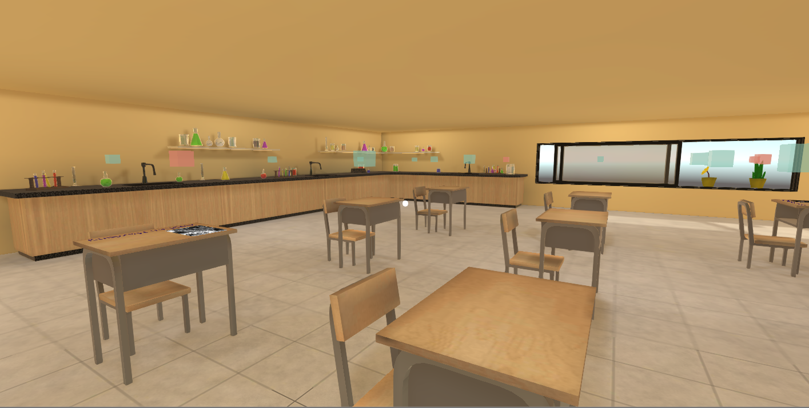

# School Museum
School Museum was created as a part of Udacity’s VR nanodegree program. We were required to research about creating VR experience for things other than games and to apply the researched concept. My chosen concept was learning new things in a school environment. Here is a brief review of the experience.

Time Taken: 10 days

### Features
* More than 1 intractable item
* Semi realistic environment
* Calm background music (from https://www.bensound.com)
* Some basic knowledge and information
* Visual feedback
* A bit optimized for mobile phones

### Software/ Plugins Used
* Unity Engine 5.6.1
* Google VR SDK 1.6
* Post Processing Stack
* 3Ds Max
* Microsoft Paint

### Download Link
not yet available (check back soon)

### More Information
You can read about the process of creating this project here: https://medium.com/@MohammedAlsayed/school-museum-udacity-night-at-the-museum-5th-project-2b42a2673782

More information about the course at: https://classroom.udacity.com/nanodegrees/nd017

## License
This project is licensed under the MIT License - see the [LICENSE.md](LICENSE.md) file for details
